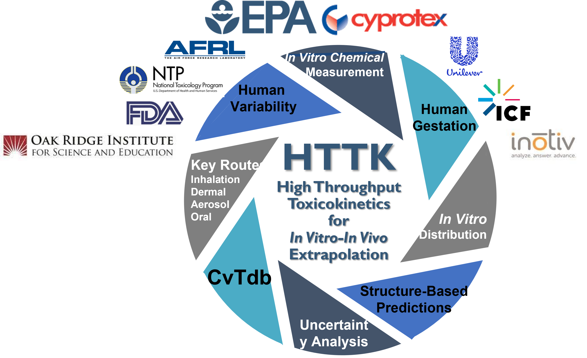

# R Package "httk"

<!-- badges: start -->
[](https://cran.r-project.org/package=httk)
[](https://cranlogs.r-pkg.org/badges/last-month/httk)
<!-- badges: end -->

This R package provides data and models for prediction toxicokinetics (chemical 
absorption, distribution, metabolism, and excretion by the body). 
The models are design to be parameterized with chemical-specific in vitro 
(animal free) measurments. The predictions can be used for traditional
dosimetry as well as in vivo-in vitro extrapolation (IVIVE) of in vitro 
bioactivity testing data (for example, ToxCast). See Breen et al. 
(2021, <https://doi.org/10.1080/17425255.2021.1935867>) for a recent review.

This repository is for reporting bugs and contributing enhancements. Installable
files, documentation, and other information can be obtained from
<https://cran.r-project.org/package=httk>. 

## Description

Pre-made models that can be rapidly tailored to various chemicals
and species using chemical-specific in vitro data and physiological 
information. These tools allow incorporation of chemical 
toxicokinetics ("TK") and in vitro-in vivo extrapolation ("IVIVE") 
into bioinformatics, as described by Pearce et al. (2017) 
(<https://doi.org/10.18637/jss.v079.i04>). Chemical-specific 
in vitro data characterizing toxicokinetics can be been obtained 
from relatively high-throughput experiments. The 
chemical-independent ("generic") physiologically-based ("PBTK") and empirical 
(for example, one compartment) "TK" models included here can be 
parameterized with in vitro data or in silico predictions which are 
provided for thousands of chemicals, multiple exposure routes, 
and various species. The models are systems of ordinary 
differential equations that are solved
using compiled (C-based) code for speed. A Monte Carlo sampler is
included for simulating human biological variability
(Ring et al., 2017 <https://doi.org/10.1016/j.envint.2017.06.004>)
and propagating parameter uncertainty 
(Wambaugh et al., 2019 <https://doi.org/10.1093/toxsci/kfz205>). 
Empirically calibrated methods are included for predicting 
tissue:plasma partition coefficients and volume of distribution (Pearce et al., 
2017 <https://doi.org/10.1007/s10928-017-9548-7>).
These functions and data provide a set of tools for using IVIVE to
convert concentrations from high-throughput screening experiments
(for example, Tox21, ToxCast) to real-world exposures via reverse 
dosimetry (also known as "RTK")
(Wetmore et al., 2015 <https://doi.org/10.1093/toxsci/kfv171>).

## Getting Started

For an introduction to R, see Irizarry (2022) "Introduction to Data Science": 
<https://rafalab.github.io/dsbook/getting-started.html>

For an introduction to toxicokinetics, with examples in "httk", see Ring (2021) in the "TAME Toolkit":
<https://uncsrp.github.io/Data-Analysis-Training-Modules/toxicokinetic-modeling.html>

### Dependencies

* Users will need the freely available R statistical computing language: <https://www.r-project.org/>
* Users will likely want a development environment like RStudio: <https://www.rstudio.com/products/rstudio/download/>
* If you get the message "Error in library(X) : there is no package called 'X'" then you will need to install that package: 
```
install.packages("X")
```
Or, if using RStudio, look for ‘Install Packages’ under ‘Tools’ tab.
* Note that R does not recognize fancy versions of quotation marks ‘,$~$’,$~$“, or$~$”. 
If you are cutting and pasting from software like Word or Outlook you may need 
to replace the quotation marks that curve toward each other with ones typed by 
the keyboard.

### Installing R package "httk"

Adapted from Breen et al. (2021) <https://doi.org/10.1080/17425255.2021.1935867>

* Getting Started with R Package httk from the R command line
```
install.packages("httk")
```
Load the HTTK data, models, and functions
```
library(httk)
```
* Check what version you are using 
```
packageVersion("httk")
```

### Examples

* List all CAS numbers for all chemicals with sufficient data to run httk 
```
get_cheminfo()
```
* List all information (If median.only=FALSE you will get medians, lower 95th,
 and upper 95th for Fup, plus p-value for Clint, separated by commans, when
 those statistics are available. Older data only have means for Clint and Fup.): 
```
get_cheminfo(info = "all", median.only=TRUE)
```
* Is a chemical with a specified CAS number available? 
```
"80-05-7" %in% get_cheminfo()
```
* All data on chemicals A, B, C (You need to specify the names instead of "A","B","C"...)
```
subset(get_cheminfo(info = "all"), Compound %in% c("A","B","C"))
```
* Administrated equivalent dose (mg/kg BW/day) to produce 0.1 uM plasma concentration, 0.95
quantile, for a specified CAS number and species
```
calc_mc_oral_equiv(0.1,chem.cas = "34256-82-1",species = "human")
calc_mc_oral_equiv(0.1,chem.cas = "99-71-8", species = "human")
```
* Calculate the mean, AUC, and peak concentrations for a simulated study (28-day daily dose, by
default) for a specified CAS number and species
```
calc_tkstats(chem.cas = "34256-82-1",species = "rat")
calc_tkstats(chem.cas = "962-58-3", species = "rat")
```
* Using the PBTK solver for a specified chem name 
```
solve_pbtk(chem.name = "bisphenol a", plots = TRUE)
```
* Create data set, my_data, for all data on chemicals A, B, C, in R 
```
my_data <- subset(get_cheminfo(info = "all"), Compound %in% c("A","B","C"))
```
* Export data set, my_data, from R to csv file called my_data.csv in the current working directory 
```
write.csv(my_data, file = "my_data.csv")
```
#### User Notes

* When using the CAS number as a unique chemical identifier with 'httk'
functions it is best to type these numbers directly (i.e. by hand) into the
console, script, Rmarkdown, etc. to avoid unnecessary error messages. Webpages,
word documents, and other sources of these CAS numbers may use a
different character encoding that does not match those used in the 'httk' data
sources.

## Help

* Getting help with R Package httk 
```
help(httk)
```
* You can go straight to the index: 
```
help(package = httk)
```
* List all vignettes for httk 
```
vignette(package = "httk")
```
* Displays the vignette for a specified vignette 
```
vignette("IntroToHTTK")
```


## Authors

### Principal Investigator 
John Wambaugh [wambaugh.john@epa.gov]

### Lead Software Engineer 
Sarah Davidson [Davidson.Sarah.E@epa.gov]

### Model Authors and Function Developers
Robert Pearce,
Caroline Ring [Ring.Caroline@epa.gov],
Greg Honda [honda.gregory@epa.gov], 
Mark Sfeir, 
Matt Linakis [MLINAKIS@ramboll.com], and
Dustin Kapraun [kapraun.dustin@epa.gov]

### Bug-Fixes and Parameter Values
Miyuki Breen [breen.miyuki@epa.gov], 
Shannon Bell [Shannon.bell@inotivco.com], 
Xiaoqing Chang [Xiaoqing.chang@inotivco.com], 
Todor Antonijevic [tantonijevic@toxstrategies.com], 
Jimena Davis, 
James Sluka [jsluka@indiana.edu],  
Nisha Sipes [sipes.nisha@epa.gov], and 
Barbara Wetmore [wetmore.barbara@epa.gov]

### Statistical Expertise
Woodrow Setzer [setzer.woodrow@epa.gov]

## License

License: GPL-3 <https://www.gnu.org/licenses/gpl-3.0.en.html>
