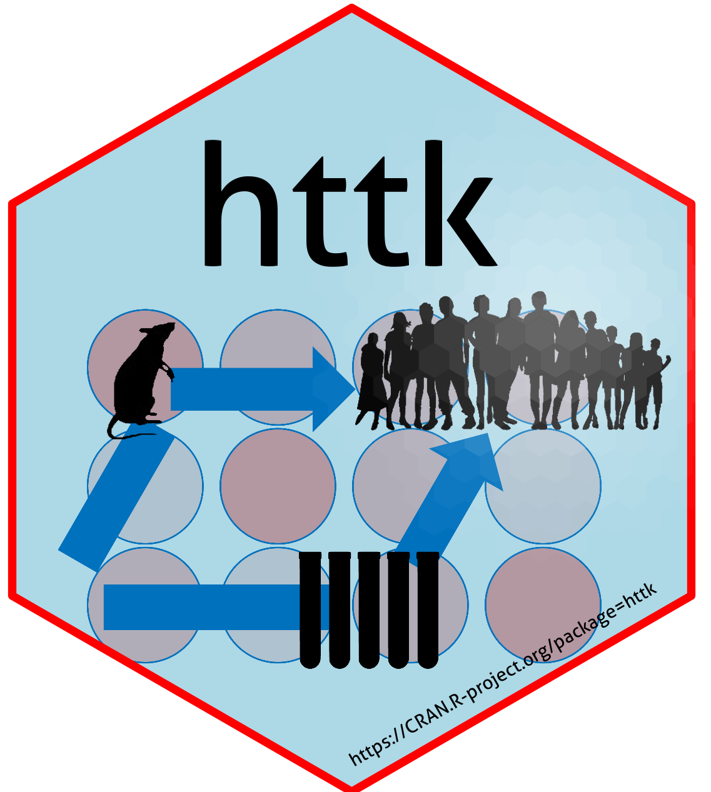

# R Package "httkexamples"



<!-- badges: start -->
[](https://cran.r-project.org/package=httkexamples)
[](https://cranlogs.r-pkg.org/badges/last-month/httkexamples)
<!-- badges: end -->

High throughput toxicokinetics ("HTTK") is the 
             combination of in vitro data and generic mathematical models to
             predict absorption, distribution, metabolism, and excretion by the
             body, as decribed by Pearce et al. (2017) 
             (<doi:10.18637/jss.v079.i04>) and Breen et al. (2021) (<doi:10.1080/17425255.2021.1935867>).
             We provide examples (vignettes) applying HTTK to solve various
             problems in bioinformatics, toxicology, and exposure science.
             In accordance with Davidson-Fritz et al. (2025) (<doi:10.1371/journal.pone.0321321>),
             whenever a new HTTK model is developed, the code to generate the 
             figures evaluating that model is added as a new vignettte.

## Loading the httk walkthroughs ("vignettes")
* List all vignettes for httk 
```
httk.vignettes()
```
* Displays the vignette for a specified vignette 
```
vignette("IntroToHTTK")
```

## Authors

### Principal Investigator 
John Wambaugh [John.Wambaugh@UL.org]

### Vignette Authors
Robert Pearce,
Caroline Ring [Ring.Caroline@epa.gov],
Greg Honda [honda.gregory@epa.gov], 
Matt Linakis [MLINAKIS@ramboll.com],
Dustin Kapraun [kapraun.dustin@epa.gov],
Kimberly Truong [truong.kimberly@epa.gov],
Annabel Meade [aemeade7@gmail.com], 
Celia Schacht [Schacht.Celia@epa.gov], and
Elaina Kenyon
