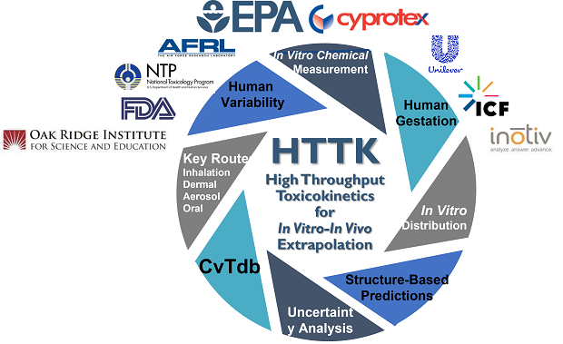
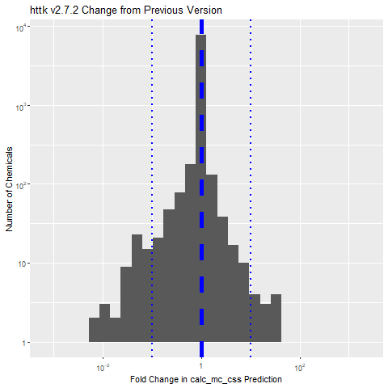

# Git Repository for R Package "httk"
# Scripts for Communicating Results and Tracking Performance
<!-- badges: start -->

<!-- badges: end -->
HTTK is "high throughput toxicokinetics", a powerful tool for helping to predict
how much chemical might pose a hazard to a person.
R package ["httk"](<https://cran.r-project.org/package=httk>) allows the 
[United States Environmental Protection Agency to
translate hazard predictions](https://www.epa.gov/chemical-research/rapid-chemical-exposure-and-dose-research#12) 
from [new approach methodlogies (NAMs)](https://www.epa.gov/chemical-research/epa-new-approach-methods-work-plan-reducing-use-vertebrate-animals-chemical)
so that they can inform
decisions on the risk posed by chemicals in commerce and the environment
to the public health. See [Breen et al. 
(2021)](<https://doi.org/10.1080/17425255.2021.1935867>) for a recent review of "httk".

This section of the httk GitHub repository provides documentation of how HTTK predictions are 
made for the [Comptox Chemicals Dashboard (CCD))](https://comptox.epa.gov/dashboard/)
and how changes in these predictions are tracked.
 
 ## Predictions for the CCD

As we improve the models and add to the data within "httk", we [release new
versions](https://cran.r-project.org/src/contrib/Archive/httk/) that 
potentially make different predictions for a given chemical.
Each time a new version of httk is released, we run the script
[httk-for-dashboard.R](https://github.com/USEPA/CompTox-ExpoCast-httk/blob/main/scripts/httk-for-dashboard.R)
to generate predictions that are made available on the CCD.

This script generates the file [Dashboard-HTTK-CssunitsmgpL.txt](https://github.com/USEPA/CompTox-ExpoCast-httk/blob/main/scripts/Dashboard-HTTK-CssunitsmgpL.txt)
which provides the steady-state plasma concentration (Css) in units of
mg/L. Volvumes of distribtion (Vd) in L/kg body weight and half-life 
in hours are also available. Multiple species (human and rat) and toxicokinetic models are used.
"httk" uses the Monte Carlo method to simulation population variability and 
propagate measurment uncertainty -- this means that both median and more sensitive 
(95th percentile) values are calculated.

The file [Dashboard-HTTK-CssunitsmgpL-previous.txt](https://github.com/USEPA/CompTox-ExpoCast-httk/blob/main/scripts/Dashboard-HTTK-CssunitsmgpL-previous.txt) provides the predictions
made with the immediately preceding version while the file 
[Dashboard-HTTK-CssunitsmgpL-change.txt](https://github.com/USEPA/CompTox-ExpoCast-httk/blob/main/scripts/Dashboard-HTTK-CssunitsmgpL-change.txt) r
eports the change in Css on a per
chemical basis. These changes are graphed in
[calc-mc-css-fold-change.png](https://github.com/USEPA/CompTox-ExpoCast-httk/blob/main/scripts/calc-mc-css-fold-change.png):

## Chemical Counts for Discussion of HTTK

The script [httk-chemical-counts.R](https://github.com/USEPA/CompTox-ExpoCast-httk/blob/main/scripts/httk-chemical-counts.R)
calculates how many chemicals have measured chemical-specific HTTK data for various species.

## Questions
If you have questions, comments, or concerns please contact:

### Principal Investigator 
John Wambaugh [wambaugh.john@epa.gov]

### Lead Software Engineer 
Sarah Davidson [Davidson.Sarah.E@epa.gov]

### CCD Coordinator
Nisha Sipes [sipes.nisha@epa.gov]